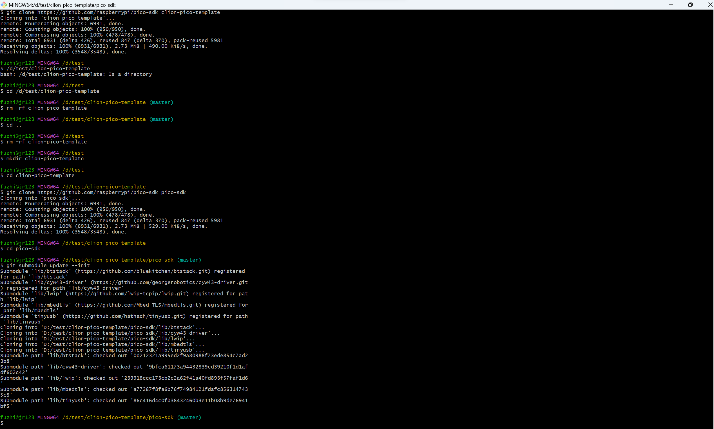

# clion-pico-template
 clion+gcc+MinGW+CMake+openOCD+pico-sdk+raspberry pico

## 安装环境
1. CLion
2. MinGW-W64_gcc
3. gcc-arm-none-eabi-10.3-2021.10-win32
4. cmake-3.24.3-windows-x86_64
5. OpenOCD-20230202-0.12.0
> 注意要将bin目录添加到系统环境变量
部分环境在CLion中默认安装
注意文件夹不可含有空格和中文
>
6. 下载**pico-sdk**及其包含的子模块

---
## 开始新建
1. clion新建工具链

2. 配置CMake
>注意要在环境栏加入**PICO_SDK_PATH**到环境变量中
>

3. clion新建项目

4. 从`pico-sdk->external`复制**pico_sdk_import.cmake**文件到项目目录下
5. 修改**CMakeLists.txt**文件
```
cmake_minimum_required(VERSION 3.23)

# initialize the SDK based on PICO_SDK_PATH
# note: this must happen before project()

include(pico_sdk_import.cmake)

project(pico C CXX ASM)

set(CMAKE_C_STANDARD 11)

# Initialize the SDK
pico_sdk_init()

add_executable(pico main.c)
target_link_libraries(pico  pico_stdlib)

# create map/bin/hex/uf2 file in addition to ELF.
pico_add_extra_outputs(pico)
```
-
    - 在`project` 行前增加`include(pico_sdk_import.cmake)` 导入PICO的SDK
    - Project中增加 `CXX ASM`，这因为SDK需要使用C++和汇编
    - 初始化SDK`pico_sdk_init`
    - 可执行程序链接上`pico_stdlib`库
    - 添加额外输出`pico_add_extra_outputs`，用于生成PICO的可执行文件，否则只有DEBUG的`.efl`文件

6. 删除原有的`cmake-build-debug`开头的所有文件夹

7. 添加测试程序
进入`main.c`文件编写LED闪烁程序
```c
#include "pico/stdlib.h"

int main()
{
    const uint LED_PIN = PICO_DEFAULT_LED_PIN;
    gpio_init(LED_PIN);
    gpio_set_dir(LED_PIN, GPIO_OUT);
    while (true)
    {
        gpio_put(LED_PIN, 1);
        sleep_ms(1500);
        gpio_put(LED_PIN, 0);
        sleep_ms(1500);
    }
}
```
8. 构建+编译生成
点击左下角的`重新加载CMake项目`

加载完后点击上方绿锤子右侧的`下拉选项`，点击编辑配置修改OpenOCD配置

如果是按官方方式仿真，则需要新建上图面板配置文件中的`0_pico.cfg`文件,程序如下
```
source [find interface/picoprobe.cfg]
source [find target/rp2040.cfg]
```
9. 烧录
pico烧录很方便，按住板载的BOOTSEL插上USB，电脑端就会出现pico磁盘

将前面生成的pico.uf2拖入该磁盘，芯片会自动重启运行该程序

## 